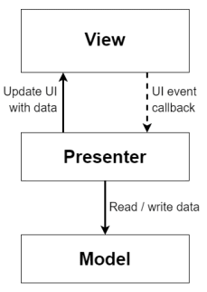

# SmartCalc v3.0

Implementation of SmartCalc v3.0 in Python.

## Contents

1. [Chapter I](#chapter-i) \
   1.1. [Introduction](#introduction)
2. [Chapter II](#chapter-ii) \
   2.1. [MVP pattern](#mvp-pattern) \
   2.2. [MVVM pattern](#mvvm-pattern)
3. [Chapter III](#chapter-iii) \
   3.1. [Part 1](#part-1-smartcalc-v30-implementation) \
   3.2. [Part 2](#part-2-bonus-loan-сalculator) \
   3.3. [Part 3](#part-3-bonus-deposit-calculator) \
   3.4. [Part 4](#part-4-bonus-configuration-and-logging) \
   3.5. [Part 5](#part-5-bonus-cross-platform)
4. [Chapter IV](#chapter-iv)

## Chapter I

Thomas stood outside the painfully familiar club, which now looked completely abandoned. Seb hadn't been seen for months, and this was probably why. \
When Thomas received a text message with no name but a familiar address, he thought it was Sebastian and jumped on the first flight to California. And even now he is still hoping that it will be Seb who shows up at the time mentioned in the message. But those hopes began to fade.

"I thought this was a popular place," a voice behind him brought Thomas out of his musings."

"What? Yes, it used to be like that," Thomas replied confusedly to the stranger.

"A guy I know used to brag about it. Said his dad used to run the place and serve the best non-alcoholic mojitos in Compton. I wish I'd had time to come here earlier when it was still open. I'm John, by the way."

"I'm Thomas. So you knew Sebastian?"

"Yeah, he and I worked in the same department. Well, he was an intern there until one day he suddenly disappeared without a word. And you?"

"We grew up in the same area. I haven't heard from him lately either. I got a message with a familiar address, so I thought it might be from him."

"A message, you say? With an address and time?" John raised an eyebrow.

"And a promise of answers to all questions, yes," Thomas replied. "Looks like we are here for a reason. And it looks like we're not the only ones," Thomas turned and noticed a girl looking around the square in front of the jazz club. "Let me guess, a mysterious text message promising answers to all your questions brought you here as well?" Thomas asked the girl.

"Yes, exactly," she replied after a moment's thought.

"Well, that makes three of us!" John exclaimed. "Instead of answers, we just get more questions. I'm John, by the way, and this is Thomas. We literally just got here and met. And you are...?"

"Eve."

"Well, nice to meet you, Eve," John said. "I'm curious to hear your guesses as to why we're here and what we're expecting," he hadn't finished speaking when another taxi pulled up beside them and a young man jumped out, dropping his bag on the way.
He looked strange to John.

"Chuck?! And you're here too?" Eve said slightly surprised.

"Oh, hi, Eve! What a faraway place to meet. How small the world is! And what do you mean, here? Did you get that weird text message too?" Chuck seemed out of breath, constantly looking around for either potential danger or something interesting. "I hope I'm not too late."

"We all got that text," John interjected. "I'm John, this is Thomas."

"I'm Chuck. I never thought it would be such a mysterious meeting in the middle of nowhere," Chuck replied, looking around.

"It's not exactly the middle of nowhere," Thomas replied. "Until a few months ago, there was a nice, lively jazz club here, owned by the father of a good friend of mine. Who, it turns out, was an acquaintance of John's. He was a colleague of yours, wasn't he? Except that neither John nor I had heard from him in over three months. And the club... Well, you can see how it's turned out," Thomas looked sadly at the building.

"Where did you work?" Eve asked John.

"A local branch of SIS," John murmured back. "Managing network applications and configuring computer hardware."

"Chuck and I are also from SIS. Different departments and the Eastern Division, but still," Eve said thoughtfully. "Where do you work, Thomas?"

"Advanced Solutions Inc. Subsidiary of SIS, recently transferred there. I had to take a leave of absence to come here, but I was seriously worried about Seb, and apparently not for nothing. It turns out that we're all connected to SIS in one way or another."

"And not just that, right, Eve?" Chuck said. "I've got some documents here that I think you might find interesting, so where are they..." Who knows where this conversation would have gone if not for the simultaneous beeping and vibrating of the smartphones in everyone's pockets.

> Greetings to all! I'm very pleased that you were interested and were able to arrive on time. You are gathered here for a reason, and you will indeed get all the answers. But only after a small test. There is one task that you like to test me on. But now it's time to trade places. Prove that you are ready and able to handle the tasks ahead of you, and then I will answer all your questions. A test with details is already waiting for you in your personal repositories. Please begin immediately. Thank you.

Thomas thoughtfully reread the text over and over again, and only Chuck's quiet whisper broke the silence:

 "The Terminator..." he whispered.

## Introduction

In this project, you will implement an extended version of the common calculator in the Python programming language that implements the same functionality as the application previously developed in the SmartCalc v2.0 project. You will hone your skills in the new programming language, learn the MVP or MVVM pattern, and add help and history functionality to the application.

## Chapter II

### MVP pattern

The MVP pattern shares two components with MVC: the model and the view. However, it replaces the controller with a presenter.

The presenter implements the interaction between the model and the view.
When the view notifies the presenter that the user has done something (such as pressed a button), the presenter decides to update the model and synchronizes any changes between the model and the view. However, the presenter does not interact directly with the view. Instead, it uses an interface to communicate. This allows all components of the application to be tested individually afterwards.

### MVVM pattern

MVVM is a more modern update of MVC. The main purpose of MVVM is to provide a clear separation between the presentation and model layers. MVVM supports bi-directional data binding between View and View Model components.

The View acts as a subscriber to property value change events provided by the View Model. When a property has changed in the View Model, it notifies all subscribers, and the View in turn requests the updated property value from the View Model. When the user interacts with an UI element, the View calls the appropriate command provided by the View Model.

A View Model is both an abstraction of a View and a wrapper of data from the Model to be bound. In other words, it contains the Model transformed into the View, as well as the commands that the View can use to affect the Model.

## Chapter III

## Part 1. SmartCalc v3.0 implementation

You need to implement SmartCalc v3.0:

- The program must be developed in Python 3.11.
- The program code must be in the src folder.
- You must stick to Google Code Style when writing code.
- You need to develop a desktop application.
- Prepare the installer, which will install the application to the system with the standard settings (installation path, creating shortcut).
- Prepare an implementation with a graphical user interface for either Linux or Mac OS, based on any GUI library or framework (GUI layer implementation in HTML/CSS/JS is acceptable).
- The program must be implemented using the MVVM or MVP pattern, and:
  - there should be no business logic code in the view code;
  - there must be no interface code in the model, presenter and view model.
- The "core" of the calculator in the form of an algorithm for the formation and calculation of the Polish notation and various computational functions connect as a dynamic library in C/C++ from the SmartCalc v1.0 or SmartCalc v2.0 projects.
- The model should be a "core" with a wrapper in Python.
- The model must have the full functionality of the calculator so that it can be used in the future without the other layers.
- Prepare full coverage of the methods in the model layer with unit tests.
- The application should have a help section with a description of the program interface in random form.
- The program must store the history of operations, allow loading expressions from the history, and clear the entire history.
- The history must be saved between runs of the application.
- Both integers and real numbers can be entered into the program, written either in point or exponential form.
- The calculation should be performed after the complete input of the calculated expression and pressing the `=` symbol.
- Calculation of arbitrary bracketed arithmetic expressions in infix notation.
- Calculate arbitrary parenthesized arithmetic expressions in infix notation with substitution of the _x_ variable as a number.
- Plotting a function defined by an expression in infix notation with the variable _x_ (with coordinate axes, scale markers, and grid with adaptive step):
  - It is not necessary to allow the user to change the scale.
- The definition range and the value range of the functions are limited at least to numbers from -1000000 to 1000000.
- To plot a function, it is also necessary to specify the displayed definition and value ranges.
- The checked accuracy of the fractional part is at least 7 decimal places.
- The user must be able to enter up to 255 characters.
- Bracketed arithmetic expressions in infix notation shall support the following arithmetic operations and mathematical functions:
  - **Arithmetic operators**:

      | Operator name | Infix Notation  (Classic) | Prefix notation   (Polish notation) | Postfix notation  (Reverse Polish notation) |
      | ------ | ------ | ------ | ------ |
      | Parentheses | (a + b) | (+ a b) | a b + |
      | Addition | a + b | + a b | a b + |
      | Subtraction | a - b | - a b | a b - |
      | Multiplication | a * b | * a b | a b * |
      | Division| a / b | / a b | a b \ |
      | Rasing to the power | a ^ b | ^ a b | a b ^ |
      | Remainder of division | a mod b | mod a b | a b mod |
      | Unary plus | +a | +a | a+ |
      | Unary minus | -a | -a | a- |

      >Please note that the multiplication operator contains a mandatory `*` sign. Processing an expression with the `*` sign omitted is optional and left to the developer's discretion.

      | Function description | Function |
      | ---------------- | ------- |
      | Calculates cosine | cos(x) |
      | Calculates sine | sin(x) |
      | Calculates tangent | tan(x) |
      | Calculates arc cosine | acos(x) |
      | Calculates the arcsine | asin(x) |
      | Calculates arctangent | atan(x) |
      | Calculates square root | sqrt(x) |
      | Calculates natural logarithm | ln(x) |
      | Calculates decimal logarithm | log(x) |

## Part 2. Bonus. Loan сalculator

Provide a special mode "loan calculator" (you can take websites like banki.ru and calcus.ru as an example):

- Input: total loan amount, term, interest rate, type (annuity, differentiated);
- Output: monthly payment, overpayment for the loan, total repayment.

## Part 3. Bonus. Deposit calculator

Provide a special mode "deposit calculator" (you can take websites like banki.ru and calcus.ru as an example):

- Input: deposit amount, deposit term, interest rate, tax rate, periodicity of payments, capitalization of interest, list of additions, list of partial withdrawals;
- Output: accrued interest, tax amount, amount on deposit by the end of the term.

## Part 4. Bonus. Configuration and logging

Add settings to the app:

- Add reading of settings from configuration file when the program runs.
- Include in the configuration file 3 or more parameters to choose from, such as background color, font size, etc.
- Add descriptions of editable parameters to help.

Add logging to the application:

- Store operation history in logs.
- Save logs in the logs folder, one file per rotation period.
- It should be possible to set the period of logs rotation (hour/day/month).
- Files must be named according to the following pattern: `logs_dd-MM-yy-hh-mm-ss` (the time of file creation).

## Part 5. Bonus. Cross-platform

Make your app cross-platform:

- Add support Linux, Mac and Windows.
- The installer should also be available for Linux, Mac and Windows (several different installers are allowed).

## Chapter IV

Thomas finished the calculator without too much trouble. He already knew Python, so he quickly put together a simple desktop application. The other guys seemed to be finishing their work as well. \
As soon as everyone was done, new messages from an anonymous person appeared on their phones:

> Thank you. I see you all did well. That's great, even though the algorithms predicted it all along. Please establish a secure connection to the server specified in the following message and connect to the chat room specified. There we will be able to talk freely and calmly. I also have some special information for Thomas and John regarding your friend Seb. See you in the chat room!

💡 [Tap here](https://forms.yandex.ru/cloud/64182ec16938722529a1286e/) **to leave your feedback on the project**. Product Team really tries to make your educational experience better.
