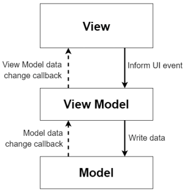

# SmartCalc v3.0

Реализация SmartCalc v3.0 на языке Python.

## Contents

1. [Chapter I](#chapter-i) \
   1.1. [Introduction](#introduction)
2. [Chapter II](#chapter-ii) \
   2.1. [Паттерн MVP](#паттерн-mvp) \
   2.2. [Паттерн MVVM](#паттерн-mvvm)
3. [Chapter III](#chapter-iii) \
   3.1. [Part 1](#part-1-реализация-smartcalc-v30) \
   3.2. [Part 2](#part-2-дополнительно-кредитный-калькулятор) \
   3.3. [Part 3](#part-3-дополнительно-депозитный-калькулятор) \
   3.4. [Part 4](#part-4-дополнительно-конфигурация-и-логирование) \
   3.5. [Part 5](#part-5-дополнительно-кроссплатформенность)
4. [Chapter IV](#chapter-iv)

## Chapter I

Томас стоял около до боли знакомого клуба, который теперь же выглядел абсолютно заброшенным. Себ не подавал никаких признаков уже несколько месяцев и видимо вот почему. \
Получив СМС без автора, но со знакомым адресом Томас сначала подумал, что это был Себастьян, и вскочил на первый рейс до Калифорнии. И даже сейчас он надеется, что именно Себ подойдет к времени указанному в СМС. Однако надежды на это таят.

`-` Я думал это было популярное место, - голос позади вывел из размышлений Томаса.

`-` А? Да, оно таким и было когда-то. - ответил растерянно Томас незнакомцу.

`-` Мне хвалился про него один знакомый. Мол его отец заправлял тут всем и подавал самый лучший безалкогольный мохито во всем Комптоне. Жаль так и не нашел времени зайти сюда пораньше, когда тут все работало. Я Джон, между прочим.

`-` Томас. Значит вы знали Себастьяна?

`-` Да, мы с ним работали в одном отделе. Точнее он стажировался у нас, пока в один день внезапно не пропал без какой-либо весточки. А вы?

`-` Росли в соседних домах. Тоже ничего не слышал от него в последнее время. Пришла вот СМСка со знакомым адресом, подумал, что это возможно от него.

`-` СМСка говорите? С адресом и временем? - поднял бровь Джон.

`-` И обещанием ответов на все вопросы, да, - ответил Томас. - Похоже мы здесь с вами оказались явно не случайно. И похоже, что не только мы одни, - Томас обернулся и заметил девушку оглядывающую площадь перед джаз-клубом. - Дайте угадаю, вас тоже сюда привела загадочная СМС с обещанием ответов на все ваши вопросы? - обратился Томас к девушке.

`-` Да, именно так, - ответила она после небольших раздумий.

`-` Ну что же, теперь нас трое! - воскликнул Джон. - Вместо ответов, получаем только еще больше вопросов. Я Джон кстати говоря, а это Томас. Сами буквально только что подошли и познакомились. А вы..?

`-` Ева.

`-` Что же, очень приятно, Ева, - сказал Джон. - Интересно послушать ваши догадки, почему мы здесь и чего мы ожидаем, - не успел он это договорить, как рядом остановилась еще одна машина такси, из которого пулей вылетел молодой парень, по пути выронив свою сумку.

`-` Чак?! И ты сюда же? - слегка удивленно сказала Ева.

`-` О, Ева! Надо же было в такой дали встретиться. Как тесен мир однако! А в каком смысле сюда же? Ты тоже получила эту странную СМСку? - запыхавшись произнес по всей видимости Чак, все время озирающийся по сторонам, в поисках не то потенциальных опасностей, не то каких-либо интересностей. - Надеюсь я не опоздал.

`-` Мы все тут получили эту СМСку, - вмешался в разговор Джон. - Я Джон, это Томас.

`-` Чак. Вот уж не думал, что такая загадочная встреча будет посреди ничего, - сказал в ответ Чак, оглядываясь по сторонам.

`-` Здесь все же не совсем ничего, - ответил Томас. - Еще несколько месяцев назад тут был неплохой оживленный джаз-клуб, принадлежащий отцу моего хорошего друга. С которым, как выяснилось, был знаком Джон. Он был твоим коллегой, верно? Вот только ни я, ни Джон ничего не слышали от него уже больше трех месяцев. А сам клуб.. Ну вы и так видите во что он превратился, - Томас с грустью обратил свой взгляд на постройку.

`-` А где вы работали? - спросила Ева у Джона.

`-` Местное подразделение SIS, - буркнул Джон в ответ. - Администрирование сетевых приложений и настройка компьютерной аппаратуры.

`-` Мы с Чаком тоже из SIS. Из разных отделов и из восточного подразделения правда, но тем не менее, - задумчиво произнесла Ева. - А ты Томас откуда?

`-` Advanced Solutions Inc. Дочка SIS, перешел туда относительно недавно. Пришлось взять отпуск, чтобы сюда добраться, но я серьезно беспокоился за Себа и похоже не зря. Получается мы все тут так или иначе связаны с SIS.

`-` И, похоже, что не только с ним, да, Ева? - отреагировал Чак. - У меня здесь есть с собой документы, которые думаю могут показаться вам интересными, где же они.. - неизвестно куда дальше бы зашел этот разговор, если бы не одновременное пиликанье и вибрация смартфонов у всех в карманах произошедшее в этот момент. В полученном всеми сообщении без автора было написано следующее:

> Приветствую всех и очень счастлив, что вы заинтересовались и смогли добраться до места назначения в указанное время. Вы собрались здесь не случайно и действительно получите все ответы. Но только после небольшого теста. Есть одно задание, которым любили проверять меня. Но теперь пришло время немного поменяться местами. Докажите, что вы готовы и сможете справиться с предстоящими заданиями, и тогда я отвечу на все ваши вопросы. Тестовое задание с подробностями уже ожидает вас на ваших личных репозиториях. Пожалуйста, приступите немедленно. Спасибо.

Томас задумчиво перечитывал текст раз за разом и только тихий шепот Чака нарушил общее молчание:

`-` Терминатор.. - прошептал тот.

## Introduction

В данном проекте Вам предстоит реализовать на языке программирования Python расширенную версию обычного калькулятора, реализующую те же самые функции, что и разработанное ранее приложение в проекте SmartCalc v2.0. Вам предстоит улучшить свои навыки владения новым языком программирования, освоить паттерн MVP или MVVM, а также добавить в приложение функционал справки и истории вычислений.

## Chapter II

### Паттерн MVP

Паттерн MVP имеет общие с MVC два компонента: модель и представление. Но он заменяет контроллер на презентер.

Презентер реализует взаимодействие между моделью и представлением.
Когда представление уведомляет презентер, что пользователь что-то сделал (например, нажал кнопку), 
презентер принимает решение об обновлении модели и синхронизирует все изменения между моделью и представлением. 
Однако, презентер не общается с представлением напрямую. Вместо этого, он общается через интерфейс. 
Благодаря чему все компоненты приложения впоследствии могут быть протестированы по отдельности.

### Паттерн MVVM

MVVM - это более современная эволюция MVC. Основная цель MVVM - обеспечить четкое разделение между уровнями представления и модели. 
MVVM поддерживает двустороннюю привязку данных между компонентами View и ViewModel.

Представление выступает подписчиком на события изменения значений свойств предоставляемых моделью представления (ViewModel). 
В случае, если в модели представления изменилось какое-либо свойство, то она оповещает всех подписчиков об этом, 
и представление, в свою очередь, запрашивает обновлённое значение свойства из модели представления. 
В случае, если пользователь воздействует на какой-либо элемент интерфейса, представление вызывает соответствующую команду, предоставленную моделью представления.

Модель представления — с одной стороны, абстракция представления, а с другой — обёртка данных из модели, подлежащих связыванию. 
То есть, она содержит модель, преобразованную к представлению, а также команды, которыми может пользоваться представление, чтобы влиять на модель.

## Chapter III

## Part 1. Реализация SmartCalc v3.0

Необходимо реализовать SmartCalc v3.0:

- Программа должна быть разработана на языке Python версии 3.11
- Код программы должен находиться в папке src
- При написании кода необходимо придерживаться Google Code Style
- Необходимо разработать десктопное приложение
- Подготовить установщик, который будет устанавливать приложение в систему со стандартными настройками (путь инсталляции, создание ярлыка)
- Необходимо подготовить реализацию с графическим пользовательским интерфейсом под Mac OS, на базе любой GUI-библиотеки или фреймворка (допустима реализация слоя GUI на HTML/CSS/JS)
- Программа должна быть реализована с использованием паттерна MVVМ или MVP, а также:
    - не должно быть кода бизнес-логики в коде представлений
    - не должно быть кода интерфейса в модели, презентере и модели представления
- “Ядро” калькулятора в виде алгоритма формирования и вычисления польской нотации и различных вычислительных функций подключить в виде динамической библиотеки на C/C++ из проектов SmartCalc v1.0 или SmartCalc v2.0
- Модель должна представлять собой "Ядро" с оберткой на языке Python
- В модель должны быть вынесены все функциональные возможности калькулятора таким образом, чтобы в будущем ее можно было использовать без остальных слоев
- Подготовить полное покрытие unit-тестами методов, находящихся в слое модели
- В приложении должен быть реализован раздел справки с описанием интерфейса программы в произвольной форме
- Программа должна хранить историю операций, позволять загружать выражения из истории и очищать историю целиком
- История должна сохраняться между запусками приложения
- На вход программы могут подаваться как целые числа, так и вещественные числа, записанные и через точку, и в экспоненциальной форме записи
- Вычисление должно производится после полного ввода вычисляемого выражения и нажатия на символ `=`
- Вычисление произвольных скобочных арифметических выражений в инфиксной нотации
- Вычисление произвольных скобочных арифметических выражений в инфиксной нотации с подстановкой значения переменной _x_ в виде числа
- Построение графика функции, заданной с помощью выражения в инфиксной нотации с переменной _x_  (с координатными осями, отметкой используемого масштаба и сеткой с адаптивным шагом)
    - Не требуется предоставлять пользователю возможность менять масштаб
- Область определения и область значения функций ограничиваются по крайней мере числами от -1000000 до 1000000
    - Для построения графиков функции необходимо дополнительно указывать отображаемые область определения и область значения
- Проверяемая точность дробной части - минимум 7 знаков после запятой
- У пользователя должна быть возможность ввода до 255 символов
- Скобочные арифметические выражения в инфиксной нотации должны поддерживать следующие арифметические операции и математические функции:
    - **Арифметические операторы**:

      | Название оператора | Инфиксная нотация   (Классическая) | Префиксная нотация   (Польская нотация) |  Постфиксная нотация   (Обратная польская нотация) |
      | ------ | ------ | ------ | ------ |
      | Скобки | (a + b) | (+ a b) | a b + |
      | Сложение | a + b | + a b | a b + |
      | Вычитание | a - b | - a b | a b - |
      | Умножение | a * b | * a b | a b * |
      | Деление | a / b | / a b | a b \ |
      | Возведение в степень | a ^ b | ^ a b | a b ^ |
      | Остаток от деления | a mod b | mod a b | a b mod |
      | Унарный плюс | +a | +a | a+ |
      | Унарный минус | -a | -a | a- |

      >Обратите внимание, что оператор умножения содержит обязательный знак `*`. Обработка выражения с опущенным знаком `*` является необязательной и остается на усмотрение разработчика

    - **Функции**:

      | Описание функции | Функция |   
      | ---------------- | ------- |  
      | Вычисляет косинус | cos(x) |   
      | Вычисляет синус | sin(x) |  
      | Вычисляет тангенс | tan(x) |  
      | Вычисляет арккосинус | acos(x) | 
      | Вычисляет арксинус | asin(x) | 
      | Вычисляет арктангенс | atan(x) |
      | Вычисляет квадратный корень | sqrt(x) |
      | Вычисляет натуральный логарифм | ln(x) | 
      | Вычисляет десятичный логарифм | log(x) |

## Part 2. Дополнительно. Кредитный калькулятор

Предусмотреть специальный режим "кредитный калькулятор" (за образец можно взять сайты banki.ru и calcus.ru):
- Вход: общая сумма кредита, срок, процентная ставка, тип (аннуитетный, дифференцированный)
- Выход: ежемесячный платеж, переплата по кредиту, общая выплата

## Part 3. Дополнительно. Депозитный калькулятор

Предусмотреть специальный режим "калькулятор доходности вкладов" (за образец можно взять сайты banki.ru и calcus.ru):
- Вход: сумма вклада, срок размещения, процентная ставка, налоговая ставка, периодичность выплат, капитализация процентов, список пополнений, список частичных снятий
- Выход: начисленные проценты, сумма налога, сумма на вкладе к концу срока

## Part 4. Дополнительно. Конфигурация и логирование

Добавить в приложение настройки:
- Добавить считывание настроек из файла конфигурации при запуске программы
- Вынести в файл конфигурации от 3 параметров на выбор, например цвет заднего фона, размер шрифта и т. д.
- Добавить описание редактируемых параметров в справку

Добавить в приложение логирование:
- В логах хранить историю операций
- Логи сохранять в папку logs, по одному файлу на период ротации
- Должна быть возможность настройки периода ротации логов (час/день/месяц)
- Файлы должны быть названы в соответствии со следующим шаблоном: `logs_dd-MM-yy-hh-mm-ss` (указывается время создания файла)

## Part 5. Дополнительно. Кроссплатформенность

Сделать приложение кроссплатформенным:
- Добавить поддержу ОС Linux
- Добавить поддержку ОС Windows
- Установщик также должен быть доступен под ОС Linux и Windows (допустимо использование нескольких разных установщиков)

## Chapter IV

Томас закончил работу над калькулятором без особых проблем. Он знал Python достаточно давно, поэтому быстро накидал простенькое десктопное приложение. Другие ребята похоже тоже заканчивали свою работу. \
Как только все управились, на их телефоны сразу же прилетели новые сообщения от анонима:

> Спасибо. Как я вижу вы все успешно справились с заданием. Это прекрасно, хотя алгоритмы и так предсказывали это с самого начала. Пожалуйста настройте безопасное соединение с указанным в следующем сообщении сервером и подключитесь к указанному чату. Там мы сможем с вами свободно и спокойно переговорить. Для Томаса и Джона у меня также есть специальная информация касательно вашего друга, Себа. Ожидаю вас в чате!
